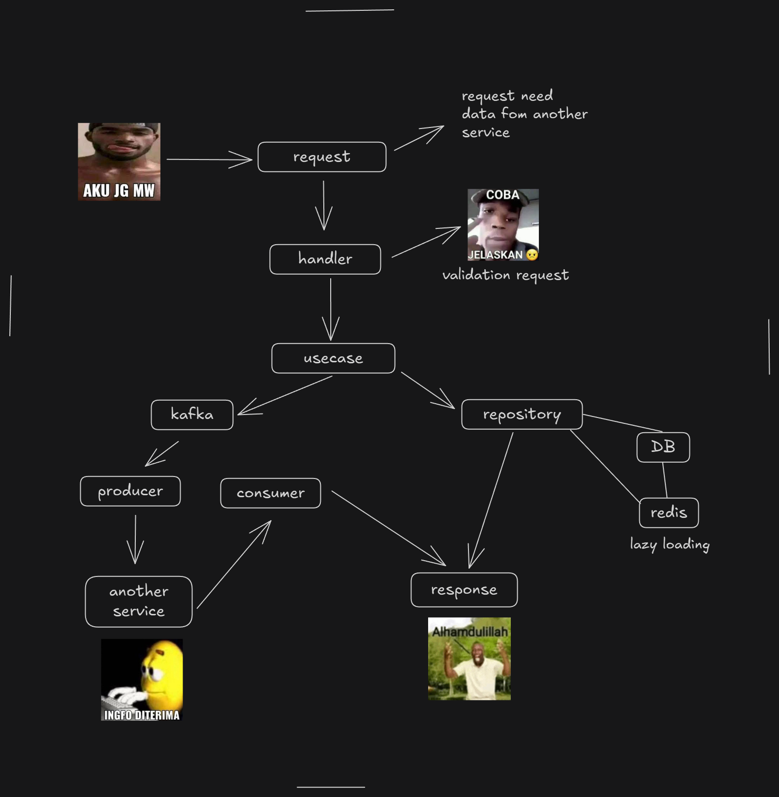

# Shop Microservices with Go & Kafka

Microservice architecture untuk aplikasi shop menggunakan Go dan Kafka sebagai message broker.  
Terdapat 5 service utama dengan port sebagai berikut:

| Service       | Port  |
|---------------|-------|
| User          | 3000  |
| Store         | 3001  |
| Product       | 3002  |
| Cart          | 3003  |
| Notification* | — (mengirim email) |

\* Notification service bertugas mengirim email sebagai consumer Kafka.

---

## Workflow API

Berikut adalah alur komunikasi antar service menggunakan Kafka dan API request:



---

## Fitur Utama

- Masing-masing service menggunakan **Clean Architecture** sebagai paradigma pengembangan
- Database menggunakan **MySQL**
- Cache menggunakan **Redis**
- Library yang digunakan:
  - [GORM](https://gorm.io) untuk ORM MySQL
  - [segmentio/kafka-go](https://github.com/segmentio/kafka-go) untuk komunikasi Kafka
  - [go-redis/redis v9](https://github.com/redis/go-redis) untuk Redis

---

## Cara Build & Jalankan

1. Build semua service dan dependency dengan docker compose:

   ```bash
   docker compose build
